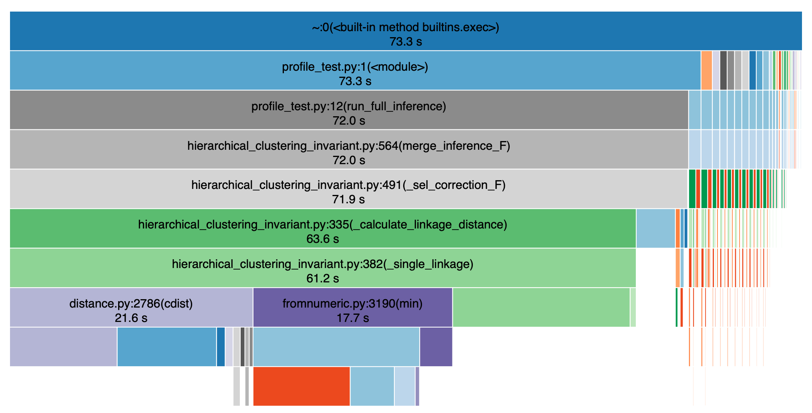
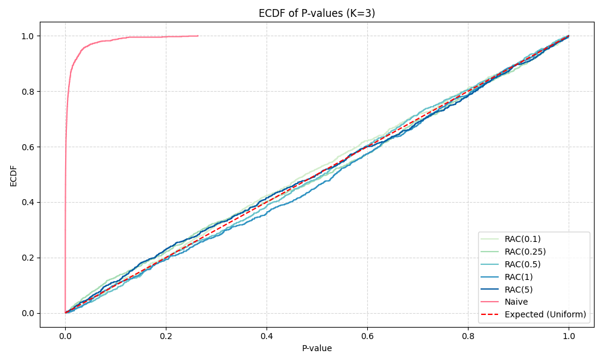

# STATS 607 Final Project Report
**Title:** Optimizing Simulation for Inference in Hierarchical Clustering

**Name**: Judy Wu

## A. Motivation

This project is motivated by the computational challenges arose from my own research project about Selective Inference on Hierarchical Clutering.
In the project, we compute the conditional p-value that takes the selection event for the winning pair at each step into account.

Consider the model 
$${X}\sim \mathcal{MN}_{n\times p}({\mu},I_n,\sigma^2 I_p),$$
where ${\mu}\in \R^{n\times p}$, with each row $\mu_i$ is unknown and $\sigma^2>0$ is unknown. Consider the null hypothesis
$$H_0: \mu_{i}=\mu_{i'}  \quad \text{for all}\quad  i,i' \in C^*_1 \cup C^*_2,$$
which assumes that all points in the merged clusters share the same mean. We define the test statistics as
$$R: = R(X;C^*_1,C^*_2) = (m-2)\cdot\frac{BCSS}{WCSS}$$
where $m = |C^*_1|+|C^*_2|$, $BCSS$ is the between-cluster sum of squares and $WCSS$ is the within-cluster sum of squares. 

The conditional p-value
$$\widehat{p} = \mathbb{P}_{H_0}(R \geq R_o\big|\bar{M} = \bar{M}_o,\mathcal{A}=\mathcal{A}_o),$$
where $\mathcal{A}$ is the auxiliary statistics and $\bar{M}$ is the merge sequence up to this step. We compute the p-value using the conditional distribution of $R$ which is characterized as follows,
$$\mathbb{F}(r) = \frac{\int_{r'\leq r}\ell_{F_{p,(m-2)p}}(r')\times {\prod_{s=1}^{t} p^{(s)}\left(M^{(t)}_o;X(r')\right)}dr'}{\int\ell_{F_{p,(m-2)p}}(r')\times {\prod_{s=1}^{t}p^{(s)}\left(M^{(t)}_o;X(r')\right)}dr'},$$
where the first term is the unadjusted distribution of $R$ and the second term is the correction term for the selection effect.

Computing the selective p-value in our framework is computationally demanding for two main reasons.

First, the correction term for valid inference depends on the entire merge sequence of the randomized agglomerative clustering procedure.

Second, the integral appearing in the selective law has no closed form and must be approximated using a discrete grid $\mathcal{G}$,
 $$\int \ell_{F_{p,(m-2)p}}(r') \prod_{s=1}^{t} p^{(s)}(M^{(s)}_o;X(r')) \, dr'
     \simeq \sum_{g \in \mathcal{G}} \ell_{F_{p,(m-2)p}}(g) \prod_{s=1}^{t} p^{(s)}(M^{(s)}_o;X(g))\delta $$
Each grid evaluation requires running the full randomized clustering algorithm to reconstruct the merge sequence and evaluate all historical probabilities. As a result, even a single p-value evaluation may require hundreds or thousands of complete clustering runs.


This becomes a computational bottleneck for downstream tasks such as running hundreds or thousands of trials to verify p-value validity through empirical CDF analysis. The goal of this project is to optimize the pipeline to accelerate the computation through more efficient grid evaluation, vectorization and parallelization.

## B. Project Description

This project focuses on improving the computational efficiency of selective inference for randomied agglomerative clustering. We also try to improve the computational stability of the algorithm. Below are the items I accomplished in the project.

* **Computational Efficiency**

    1. Profiling the existing inference pipeline to spot the main bottlenecks
    2. Optimizing the grid evaluation to accelerate the computation for the selection correction term.
    3. Setting up parallelization for validity simulation.

* **Computational Stability**
    1. Handling numerical underflow occures when having low level of randomization.
* **Reproducibility**
    1. Modularize the original code to organize the project.
    2. Setting up random seeds.
    3. Setting up test files.

**Course concepts and techniques used**
    
1. Profiling
2. vectorization
3. parallelization
4. modular software design
5. Handling numerical instability using log-sum-exp
6. setting up random seed
7. testing

## C. Results

### Computational Efficiency

#### Profiling Results

To locate the computational bottleneck of the inference procedure, I created `profile_test.py` to profile the full p-value computation pipeline (including fitting and inference), and visualized the profiling results using snakeviz. In this experiments,we use $n=30$ and $p=2$ and generate data under the null hypothesis. We use the full grid with `ngrid=2000` to approximate the integral. The result is presented as follows.



The visualization shows that almost the entire runtime of the inference pipeline is dominated by the `merge_inference_F` routine, which internally spends most of its time in `_sel_correction_F`. Within this component, the major bottleneck is the repeated computation of linkage distances, especially through _calculate_linkage_distance, _single_linkage, and SciPy’s cdist function. These steps are responsible for over 60 seconds of the total ~73-second runtime, indicating that the main computational burden arises from recomputing pairwise distances and linkage updates for each grid evaluation. This profiling result directly motivated subsequent optimization efforts such as vectorization and parallelization.

#### Grid evaluation optimization

##### 1. Coarse grid approximation

Instead of using a fine grid and complete full clustering procedure for each grid value when computing the selection correction term, we used a coarse grid to reduce the number of required evaluations and use intropolation to approximate the correction term on the full grid so that we can substantially lower the computational cost. 

This part is implemented in `merge_inference_F` in `hierarchical_clustering_invariant.py` where we added the `ncoarse` parameter to set up the coarse grid.

 Profiling was ran again using the coarse grid and to visualize the performance with the coarse grid `ncoarse=20`. The run time was reduced from 73.3 seconds to **3.31** second.

To see whether using the coarse grid can give a close result to that obtained by using the full fine grid, we added function `test_coarse_grid_accuracy` in `test_pval.py`, which compares the two p-values under fixed random seeds and checks that their difference remains within an acceptable numerical tolerance. The test passed, meaning that the p-value obtained using the coarse grid remains within our predefined tolerance. This suggests that the coarse grid provides an accurate and computationally efficient approximation of the full procedure.


##### 2. Grid width adjustment

The original discrete-grid method suffers from numerical inconsistencies because the integration grid must be chosen manually. If the grid is too short, the tail mass of the corrected distribution is truncated, which leads to unstable or biased p-values. If the grid is too long, the method becomes unnecessarily slow and the selection probabilities may underflow, especially when the posterior mass is highly concentrated. 

To address this issue, we introduced a two-stage adaptive grid refinement strategy. We first evaluate the selection correction term on a coarse grid. Using this coarse-grid approximation, we reconstruct the corrected posterior density and compute its empirical CDF on the fine grid. From this CDF, we identify an interval that contains nearly all of the posterior mass. We then generate a shorter, more focused grid inside this interval and recompute the correction term only on this refined domain. 

This procedure is implemented in `merge_inference_F_grid` function in `hierarchical_clustering_invariant.py`. The corresponding test functions are included in `test_pval.py`.


#### Parallelization

Verifying the validity and obtaining the ecdf of the p-values requires running a large number of repeated simulations, each involving randomized clustering, selection-correction evaluation, and p-value computation. Running these trials sequentially is prohibitively slow. To accelerate the process, I implemented parallelization using joblib.Parallel. Each trial is executed independently across different workers, with separate random seeds generated via NumPy’s SeedSequence to ensure reproducibility. This parallel setup reduces the total runtime and makes I error studies computationally feasible. The implementation is included in `utils.py`. The simulation script `run_validity.py` can be executed on Great Lakes with a simple Slurm submission file. When allocated 32 CPU cores, the parallel implementation completes 1,000 trials in roughly five minutes, making large-scale validity checks efficient.

The following plot is the ecdf of our p-values using different randomization level obtained from 1000 trials.




### Numerical Instability

We sometimes observed numerical instability when having low level of randomization, where the selection correction term becomes sharply peaked and direct exponentiation of the log posterior leads to overflow or underflow. After locating that the instability arose during the computation of the selection-adjusted posterior density, we fixed the issue by applying a standard log-sum-exp stabilization. we subtract the maximum log value before exponentiation and then renormalize. This prevents numerical explosion and ensures that the posterior integrates to one. A uniform fallback distribution is used only in the degenerate case where the normalized weights collapse to zero due to floating-point precision limits. The code snippet is shown below, which can be also found in `merge_inference_F_grid` in `hierarchical_clustering_invariant.py`.

```python
log_prior = f.logpdf(x=fine_grid, dfn=dfn, dfd=dfd)
sel_probs = interpolation.sum(axis=0)
log_post = log_prior + sel_probs

log_post_shift = log_post - np.max(log_post)
posterior = np.exp(log_post_shift)
posterior_sum = posterior.sum()
if posterior_sum == 0 or np.isnan(posterior_sum):
# fallback: use uniform distribution to avoid nan
    posterior = np.ones_like(posterior) / len(posterior)
else:
    posterior = posterior / posterior_sum
```


### Reproducibility

To ensure that the results can be reliably regenerated, I incorporated several reproducibility-oriented practices. First, I modularized the original codebase, separating data generation, algorithm, simulation routine and visualization into independent components. Second, I set up random seeds throughout the pipeline to ensure that we can get conistent results. Finally, I created dedicated test files to verify the correctness of key functions and to detect instability or unintended changes early. Together, these steps greatly enhance the robustness and reproducibility of the entire project.

## D. Lessons Learned

The main challenge I encountered was improving the speed of the algorithm while preserving the correctness. Using optimization strategies such as vectorization and coarse grid approximation can introduce errors or changing the behavior of the method. Specifically, for the grid evaluation, sometimes it's hard to tell whether invalid p-values were produced due to numerical instability or errors in code. This required additional validation tests, and the use of more stable numerical techniques to ensure that accuracy was not sacrificed for efficiency.

Through this project, I learned how to organize simulations in a more systematic way. I tried to structure my experiments and saving results in a cleaner way. I also learned to use test fils effectively for debugging and verifying individual components, as well as manage seeding correctly so that randomized procedures produce stable results. Overall, the project strengthened both my computational skills and my ability to build reliable, reproducible scientific workflows, which is very beneficial to my future research.